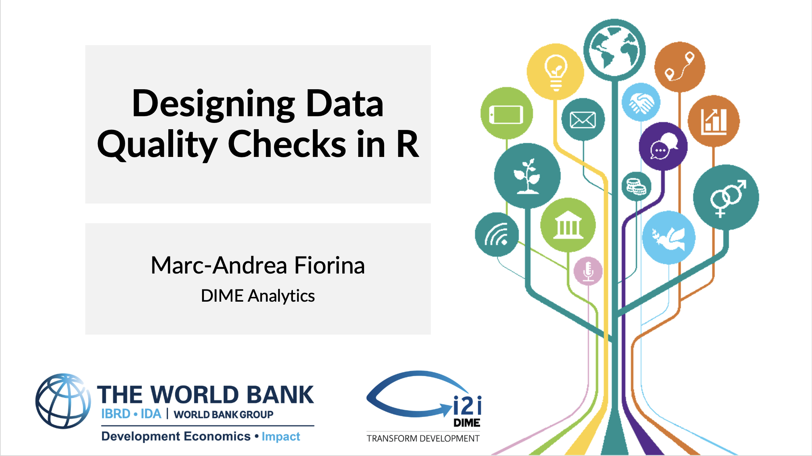

```{r setup, include = FALSE}

# Load packages
library(knitr)
library(tidyverse)
library(janitor)
library(openxlsx)
library(googledrive)
library(googlesheets4)
library(hrbrthemes)
library(fontawesome)
library(here)
library(xaringanExtra)
library(countdown)

here::i_am("slides/r_data_quality_checks.Rmd")

options(htmltools.dir.version = FALSE)
opts_chunk$set(
  fig.align = "center",
  fig.height = 4,
  dpi = 300,
  cache = T
  )

xaringanExtra::use_panelset()
xaringanExtra::use_webcam()
xaringanExtra::use_clipboard()
htmltools::tagList(
  xaringanExtra::use_clipboard(
    success_text = "<i class=\"fa fa-check\" style=\"color: #90BE6D\"></i>",
    error_text = "<i class=\"fa fa-times-circle\" style=\"color: #F94144\"></i>"
  ),
  rmarkdown::html_dependency_font_awesome()
)

```

class: clear

```{r, echo = FALSE, out.width = "100%", fig.align = "center"}


```

---

# Table of Contents

1. [Introduction](#intro)

2. [Duplicate IDs](#duplicates)

3. [Outliers](#outliers)

4. [Descriptive Statistics](#desc_stats)

5. [Enumerator-Level Checks](#enum_level)

6. [Geographic/Administrative Unit-Level Checks](#admin_level)

7. [Survey Programming Checks](#survey_programming)

8. [Exporting and Sharing Your Data Quality Checks](#exporting)

---

class: inverse, center, middle
name: intro

# Introduction

---

# Introduction

### Purpose of this session

- To show you how to create a basic, comprehensive set of data quality check outputs
- To introduce a simple data process to run data quality checks efficiently

### What we will do today

- Define a basic set of data quality checks to conduct
- For each type of check, we will produce one or two outputs, in the form of a table or graph
- We will discuss options for importing, wrangling, exporting, and sharing data quality checks

### What we will not do today

- Discuss back checks
- Discuss non-data based forms of data quality checks, such as audio audits

---

# Introduction

### A basic set of data quality checks

- Duplicate IDs
- Outliers
- Descriptive statistics
- Enumerator-level checks
- Administrative/Geographic unit-level checks (e.g. village, county, etc.)
- Unit of observation-level checks (e.g. household, firm, etc.)
- Survey programming checks

.notes[
Note — This is a set of checks that could reasonably be expected to be conducted for any data collection exercise. Depending on context, you may not need/want to implement every one of these. There may also be other checks that are necessary/useful for your context, but which are not covered here.
]

---

# Setting the Stage

Open the `06-data-quality-script.R` companion script in the folder `lab-6-data-quality/code/`. We will be reading through this script today, and you will follow along.

Run `1. Setup`. If you do not have one of the packages installed, uncomment `install.packages("<PACKAGE>")` and run the section again.

Run `2. Data Import` and `3. Basic Cleaning`. Notice that when running data quality checks, we often have to do a little data cleaning (in this case, converting missing values to `NA`) to make sure that the checks run correctly.

---

class: inverse, center, middle
name: duplicates

# Duplicate IDs

---

# Duplicate IDs

.panelset[

.panel[.panel-name[Process]

<b><u>Duplicate IDs can occur when:</u></b>
- Multiple enumerators survey the same household/firm/etc.
- There is an input error for the ID field.

<b><u>Process to address duplicate IDs:</u></b>
- Identify IDs that appear multiple times in the dataframe.
- In the HFC process — choose what to temporarily do with the duplicate observations. You could:
    - Drop them until they are resolved
    - Keep them. A possible way to do this is to modify the ID field for duplicate observations so that the dataframe is once more uniquely identified. e.g. if there are two observations with ID `101`, modify them to be `101_1` and `101_2`. The companion script shows how to do this.
- Check with the data collectors to determine why the duplicate observations occurred.
- Either dropping one of the duplicate observations or correct their ID in the data <b><i>prior</i></b> to running your data quality checks. This means creating a <b><i>"corrections"</i></b> script that is run prior to creating these quality check outputs.

]

.panel[.panel-name[Code]

In the companion script, the code:

- Uses `group_by()` and `summarize()` to identify IDs that appear multiple times

- Outputs duplicate observations to `duplicate check`, including:
    - Household enumerator, and location identifiers
    - Some outcome indicators. These can give an indication of whether the same household was surveyed twice or not.
    
- Modifies the `hhid` field in `survey_data` so that the dataframe is once again uniquely identified. e.g. there are two observations with `hhid == 3004`, so we change them to become `3004_1` and `3004_2`.

]

]

---

class: inverse, center, middle
name: outliers

# Outliers

---

# Outliers

.panelset[

.panel[.panel-name[Process]

<b><u>Outliers can occur when:</u></b>
- The enumerator makes an input error. e.g. they enter `100000` instead of `10000`.
- Naturally! Sometimes specific observations are very different from the rest of the sample. So we don't want to automatically remove every outlier we find.

<b><u>Process to address outliers:</u></b>
- Identify observations who have a variable whose value is outside of an acceptable range.
    - This range can be absolutely defined (e.g. if someone says they work more than 20 hours a day, we should confirm that).
    - This range can be defined relative to the variable's distribution in the sample. For instance, we could identify values that are more than 3 standard deviations away from the variable's mean.
- Check the outlier values with the data collectors.
- If there was a mistake, use a corrections script to fix the value. Once more, this should happen <b><i>prior</i></b> to the data quality checks process, so that only the "correct" outliers remain in the data.

]

.panel[.panel-name[Code]

In the companion script, the code:

- Defines a set of variables that we want to check for outliers. In our case, those are:
    - Household Member 1's income (`inc_01`)
    - Household's revenue from selling crop 1 (`crp10a_c1_p1`)
    - Household's revenue from selling crop 2 (`crp10a_c1_p2`)

- For each variable, uses `map()` and `filter()` to select households where the variable's value is more than 3 standard deviations away from the mean.

- Creates the `outlier_check` dataframe, which includes:
    - Household and enumerator identifiers
    - Average, "lower," and "upper" limits for the given variable. This helps determine how significant the outlier is.

]

]

---

class: inverse, center, middle
name: desc_stats

# Descriptive Statistics

---

# Descriptive Statistics

.panelset[

.panel[.panel-name[Process]

<b><u>Basic descriptive statistics for our data collection's process outcome indicators can serve to:</u></b>
- Verify that the indicator's values are in an expected range
- Get an initial sense of the distribution of this indicator within our sample

<b><u>To output descriptive statistics, we can:</u></b>
- Create a summary statistics table, with statistics such as mean, median, standard deviation, minimum, maximum. This is what the script does.
- Create some exploratory graphs.

]

.panel[.panel-name[Code]

In the companion script, the code:

- Defines a set of variables for which we want descriptive statistics.

- For each variable, uses `map()` and `summarize()` to output the desired summary statistics.

- Uses `pivot_longer()` and `pivot_wider()` to reshape the dataset into its intended structure (one row per indicator of interest).

- Replaces the indicator's variable name (e.g. `inc_01`) with a variable label (e.g. "First household member income").

]

]

---

class: inverse, center, middle
name: enum_level

# Enumerator-Level Checks

---

# Enumerator-Level Checks

.panelset[

.panel[.panel-name[Process]

<b><u>Enumerator-level checks can serve to:</u></b>
- Verify whether an enumerator is collecting data in an unusual manner. Useful checks for this are average survey duration, descriptive statistics, and percentage of don't know/refused to respond answers.
- Check progress. Useful checks for this are total number of surveys and surveys per day.

.notes[
Note — While data-based checks help with this, the best instrument to catch enumerator fraud is <b>audio audits</b>.
]

<b><u>To output enumerator-level checks, we can:</u></b>
- Create a <b>summary dataframe where the enumerator is the unit of observation</b>, with summary statistics drawn from the original dataframe.
- Create data visualizations, e.g. to show cumulative number of surveys per enumerator over time.
- If the data collection process assigned specific households/firms to enumerators, we can also track progress for each enumerator as a percentage of expected surveys.

]

.panel[.panel-name[Code]

In the companion script, the code:

- Uses `group_by(enumerator, submissiondate)` to summarize the number of surveys collected per enumerator per day, creating `enumerator_check_by_day`. `pivot_wider()` reshapes the dataframe to be at the enumerator level.

.notes[
Note — SurveyCTO exports a `submissiondate` variable, but it has both the date and time of submission. A useful tool to convert this to date is the `lubridate::date()` function.
]

- Creates `enumerator_check` using `summarize()` to obtain number of surveys and descriptive statistics per enumerator.

- Uses `left_join()` to add the per-day data to `enumerator_check`.

]

]

---

class: inverse, center, middle
name: admin_level

# Geographic/Administrative Unit-Level Checks

---

# Geographic/Administrative Unit-Level Checks

.panelset[

.panel[.panel-name[Process]

<b><u>Geographic/Administrative unit-level checks can serve to:</u></b>
- Track progress. Useful checks for this are total number of surveys and number of surveys per day.
- Check for potential general data collection issues. e.g. in a randomized controlled trial, a check at the randomization level (e.g. village) can confirm whether participants are complying with their treatment.

<b><u>To output geographic/administrative unit-level checks, we can:</u></b>
- Create a <b>summary dataframe where the geographic/administrative unit is the unit of observation</b>, with summary statistics drawn from the original dataframe.
- Create data visualizations, e.g. to show cumulative number of surveys per geographic/administrative unit over time.
- If we have the expected number of surveys per geographic/administrative unit, we can also track progress for each of them as a percentage of expected surveys.

]

.panel[.panel-name[Code]

In the companion script, the code:

- Uses `group_by(village, submissiondate)` to summarize the number of surveys collected per village per day, creating `village_check_by_day`. `pivot_wider()` reshapes the dataframe to be at the village level.

- Creates `village_check` using `summarize()` to obtain number of surveys and descriptive statistics per village.

- Uses `left_join()` to merge in `num_to_survey` (expected number of surveys per village) from `admin_data`.

- Uses `left_join()` to add the per-day data to `village_check`.

.notes[
Note — If we wanted to include villages where no survey has been conducted yet, we could use `right_join()` to merge in `admin_data` instead of `left_join()`.
]

]

]

---

class: inverse, center, middle
name: survey_programming

# Survey Programming Checks

---

# Survey Programming Checks

.panelset[

.panel[.panel-name[Process]

<b><u>Survey programming checks can serve to:</u></b>
- Monitor survey programming issues that can't be programmed into the survey instrument.
- Implement "soft" survey restrictions. Sometimes, we don't want to use relevances or conditions to prevent a certain outcome in our survey, but we still want to monitor this outcome when it occurs. e.g. a survey where if the head of household is under 18, we still want to proceed, but we want to double-check with the enumerator that there was no other option.

.notes[
Note — We can often block undesired programming issues from occurring using relevances and conditions in the survey instrument. This is often preferable to monitoring the in data quality checks.
]

<b><u>To output survey programming checks, we can:</u></b>
- Create a <b>summary dataframe for each issue we want to check</b>, with accompanying relevant indicators that will help us address this issue.

]

.panel[.panel-name[Code]

In the companion script, the code:

- Performs three programming issue checks:
    - Survey form definition — whether a survey submission used an old version of the survey.
    - Crop production vs. sale unit — whether a household provided the same unit for production and sale of a crop. This is an example of a condition that we may not want to hard-code into the survey, but that we may want to monitor or even discourage.
    - Wrong site — whether a household said that we had the wrong worksite on record for them.
    
- For each issue, uses `filter()` to create `<ISSUE>_check` and creates a new `issue` variable that describes the problem.

- Uses `bind_rows()` and `left_join()` to create `survey_programming_check`, which includes:
    - Household and enumerator identifiers
    - The `issue` variable, describing the problem
    - Additional variables that will help us address each issue

]

]

---

class: inverse, center, middle
name: exporting

# Exporting Your Data Quality Checks

---

# Exporting Your Data Quality Checks

.panelset[

.panel[.panel-name[Process]

The method you use to export and share your data quality checks is key for your process's effectiveness.

Questions to ask when determining the method you'll use:
- Who needs to see these data quality checks? Is it easy to share your data quality check outputs with them?
- Is your process efficient? How simple is it for you to export and share these outputs?
- Are your outputs accessible? Are they clear and easy to understand?

<b><u>Some options to export and share your data quality checks:</u></b>
- Microsoft Excel
- Google Sheets
- Shiny dashboard
- Anything else?

]

.panel[.panel-name[Code]

In the companion script, the code:

- Exports our data quality check dataframes to Excel. This was the simplest to implement for this session, but has the downside of requiring some manual customization in Excel.

- Uses `loadWorkbook()`, `writeData()`, and `saveWorkbook()` from the `openxlsx` package to modify the `lab-6-data-quality/output/hfc_output.xlsx` spreadsheet.

- Simplest method to create more visually appealing tables within Excel:
    - Export each dataframe to a `<CHECK>_data` sheet. e.g. the enumerator-level checks are in the `enum_data` sheet.
    - Use Excel functions to build better-looking tables in a separate sheet. e.g. the enumerator-level tables are in the `Enumerators` sheet.

]

]

---

class: inverse, center, middle
name: exporting

# Conclusion

---

# Conclusion: Final Notes

### Purpose of this session

- To show you how to create a basic, comprehensive set of data quality check outputs
- To introduce a simple data process to run data quality checks efficiently

<b>The data quality checks presented in this session are not intended to be comprehensive</b>. There is much more that could be done in terms of visualization types or export format that we did not have time to cover.

The hope is that these slides and the companion script can serve as a template for people who want to design their own data quality checks process.

### A possible helper tool?

DIME Analytics is developing <b>iehfc</b>, an interactive platform that will allow users to set up and customize data quality checks. This platform will use the same approach and methods presented in today's session! Look out for a first version later in 2023.

---

class: clear

```{r, echo = FALSE, out.width = "100%", fig.align = "center"}


```
